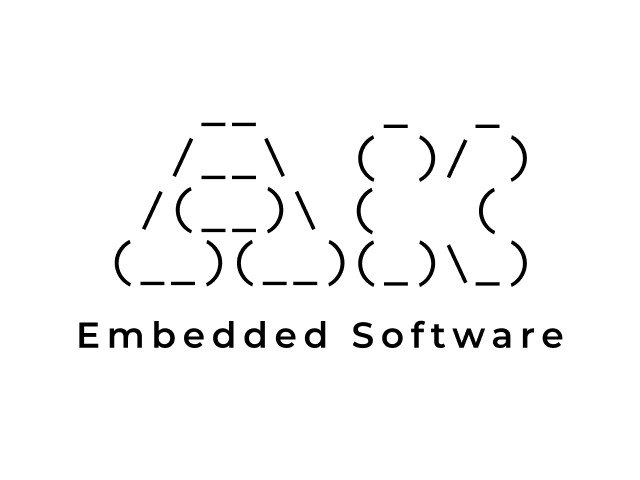
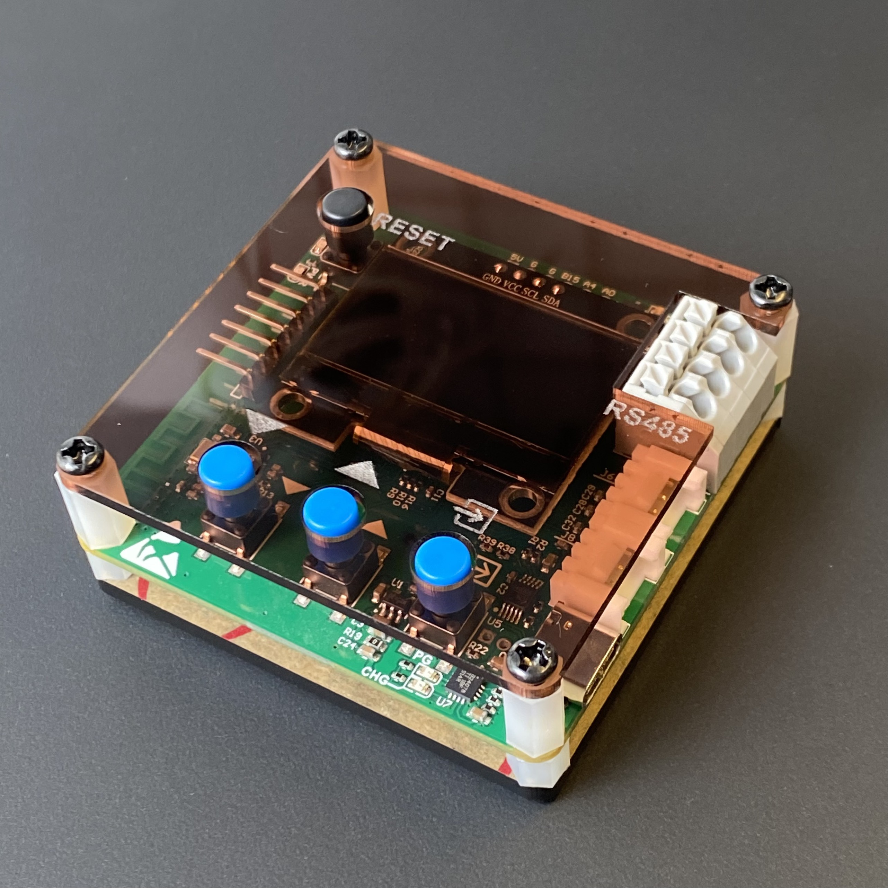
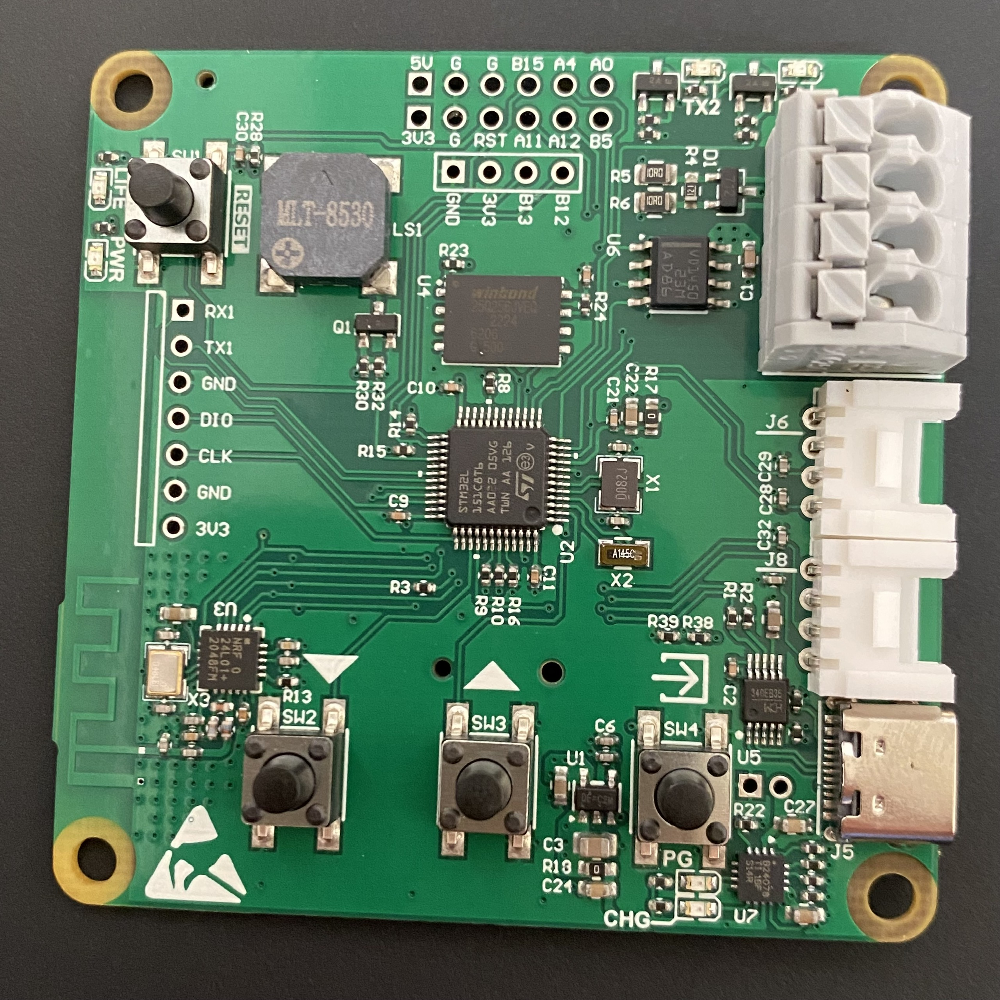
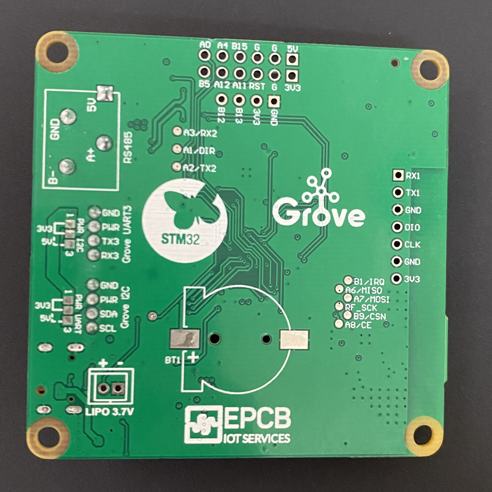

## AK Embedded Base Kit - STM32L151 - Lập trình nhúng vi điều khiển

[](https://github.com/epcbtech)

AK Embedded Base Kit is an evaluation kit for advanced embedded software learners.
- The KIT integrates 1.3" Oled LCD, 3 push buttons, and 1 Buzzers that play music, to learn the event-driven system through hands-on game machine design.
- The KIT also integrates RS485, NRF24L01+, and Flash up to 32MB, suitable for prototyping practical applications in embedded systems such as: wired communication, wireless wireless, data logger storage applications,...

[](https://epcb.vn/products/ak-embedded-base-kit-lap-trinh-nhung-vi-dieu-khien-mcu)

### Memory map
- [ 0x08000000 ] : **Boot** [[ak-base-kit-stm32l151-boot.bin]](https://github.com/epcbtech/ak-base-kit-stm32l151/blob/main/hardware/bin/ak-base-kit-stm32l151-boot.bin)
- [ 0x08002000 ] : **BSF** [ Memory for data sharing between Boot and Application ]
- [ 0x08003000 ] : **Application** [[ak-base-kit-stm32l151-application.bin]](https://github.com/epcbtech/ak-base-kit-stm32l151/blob/main/hardware/bin/ak-base-kit-stm32l151-application.bin)

**Note:** After loading boot & application firmware, you can use [AK - Flash](https://github.com/epcbtech/ak-flash) to load the application directly through the **USB** port on the KIT
```sh
ak_flash /dev/ttyUSB0 ak-base-kit-stm32l151-application.bin 0x08003000
```

### Hardware
[](https://epcb.vn/products/ak-embedded-base-kit-lap-trinh-nhung-vi-dieu-khien-mcu)

[](https://epcb.vn/products/ak-embedded-base-kit-lap-trinh-nhung-vi-dieu-khien-mcu)

### Reference
| Topic | Link |
| ------ | ------ |
| Blog & Tutorial | https://epcb.vn/blogs/ak-embedded-software |
| Where to buy KIT? | https://epcb.vn/products/ak-embedded-base-kit-lap-trinh-nhung-vi-dieu-khien-mcu |
