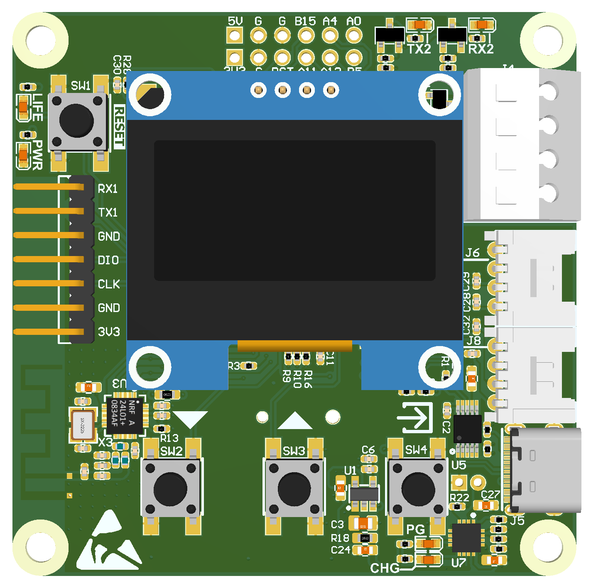
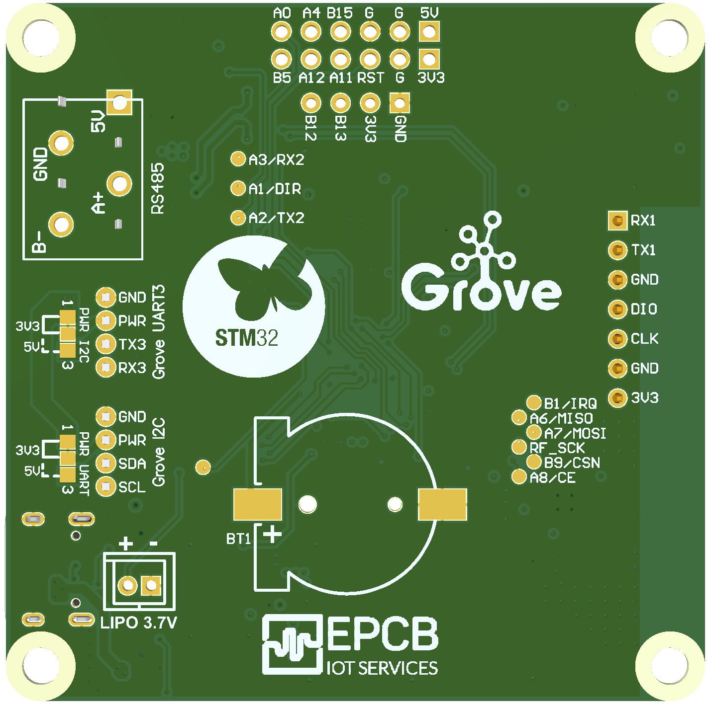

# SourceTemplate: **arm_cortex_m3_base**

## **AK Embedded Base Kit - Lập trình nhúng vi điều khiển - STM32L151**
##### TOP

##### BOTTOM

## **Where to buy KIT?**
https://epcb.vn/products/ak-embedded-base-kit-lap-trinh-nhung-vi-dieu-khien-mcu
