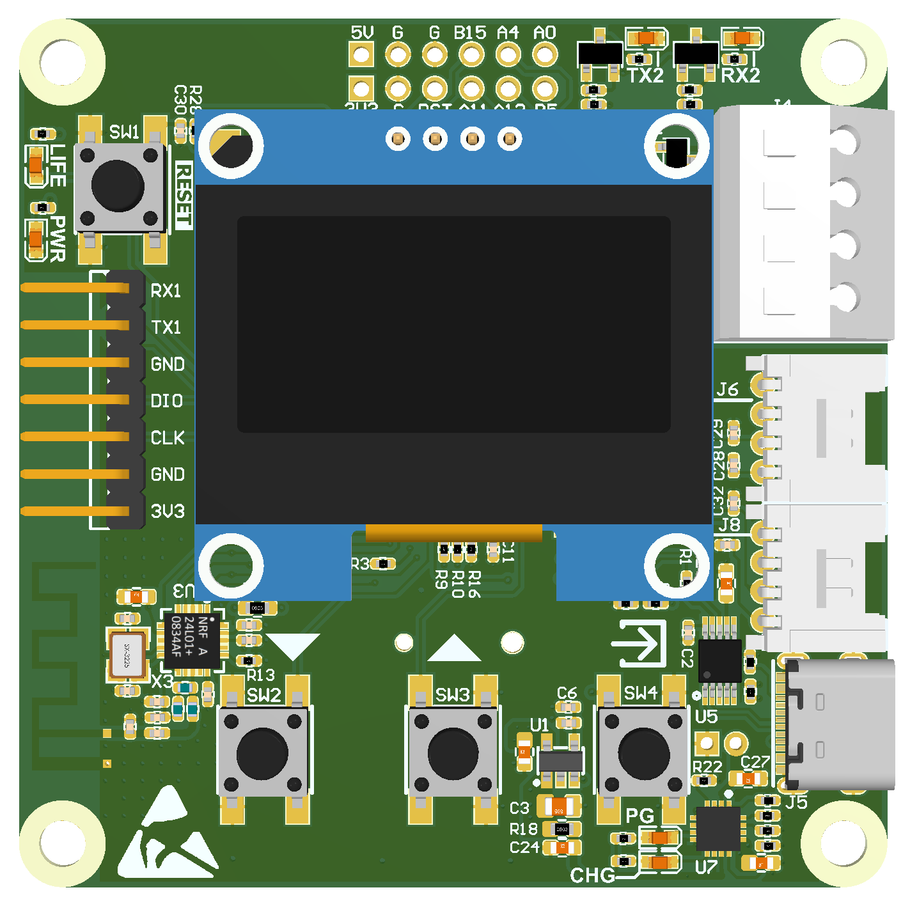
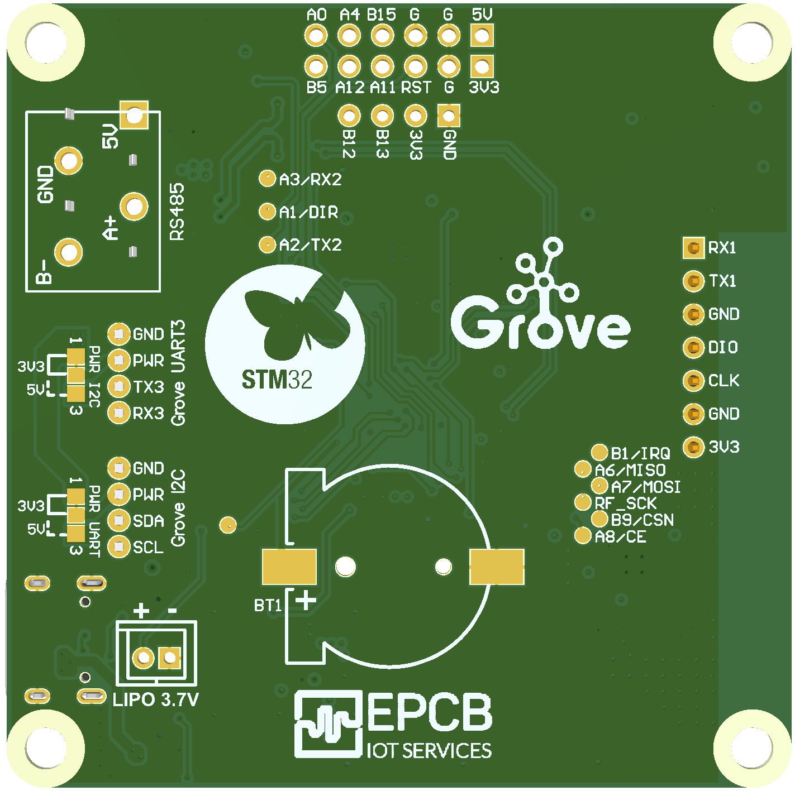

## **AK - Embedded Software**

## AK - Embedded Base Kit - Lập trình nhúng vi điều khiển - STM32L151

[ 0x08000000 ] : Boot && [ 0x08003000 ] : Application

[ Blog & Tutorial ] https://epcb.vn/blogs/ak-embedded-software

[ Where to buy KIT? ] https://epcb.vn/products/ak-embedded-base-kit-lap-trinh-nhung-vi-dieu-khien-mcu

